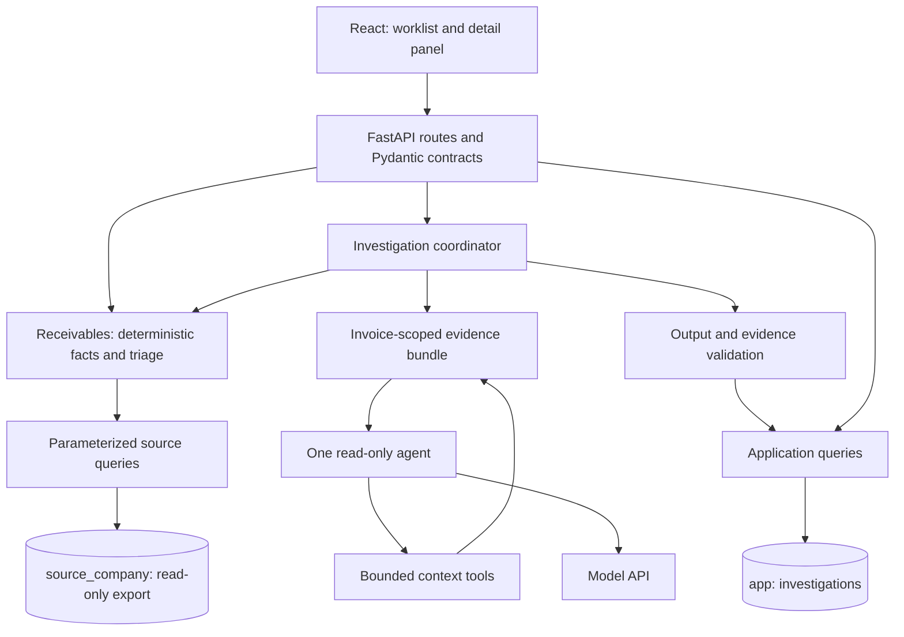

# Architecture

## Shape and responsibilities

One React frontend, one FastAPI backend, PostgreSQL, and one model API. Use one application with distinct modules, not separate services. [Product.md](Product.md) owns scope, [Data.md](Data.md) calculations/entities, and [Investigation.md](Investigation.md) investigations.



Normal reads never call the model. `receivables.py` receives source records and the cutoff date and produces the same facts for the UI, agent, and tests. No HTTP or model dependencies belong in its calculation functions.

For investigations, fetch one invoice-scoped evidence bundle and release the DB connection. Seed mandatory facts/notes; tools expose additional bundle sections. This keeps inputs consistent and hashable without a DB transaction across model latency. Record which sections the model actually receives, not merely those prefetched.

```mermaid
sequenceDiagram
    actor User
    participant UI
    participant API
    participant DB
    participant Agent
    User->>UI: Assess invoice
    UI->>API: POST investigation
    API->>DB: Load evidence and check matching result
    alt Matching completed result, no refresh requested
        DB-->>API: Saved assessment
    else New run
        API->>DB: Insert running investigation; commit
        API->>Agent: Invoice facts, notes, permitted context tools
        Agent->>Agent: Inspect relevant bundle sections
        Agent-->>API: Structured assessment and optional email
        API->>API: Validate evidence and permitted action
        API->>DB: Save completed assessment and trace
    end
    API-->>UI: Result, suggested email, saved evidence
    User->>UI: Review findings and act in the existing system
```

Failure handling, limits, and reuse are specified in Investigation.md. No background worker, streaming transport, scheduler, Redis, agent-to-agent handoff, or vector database is required.

## Stack and configuration

| Layer | Choice / role |
|---|---|
| Frontend | React + TypeScript + Vite; selected shadcn/ui components with Tailwind; Recharts for the small trend. Use local component state and a typed fetch wrapper; no global state library initially. |
| API | FastAPI + Pydantic, served by Uvicorn. Python dependencies managed with uv. |
| Database | PostgreSQL 15+; use a compatible container/client to restore the supplied dump unchanged. SQL migration for application tables. |
| Driver | Psycopg 3 with `psycopg_pool.AsyncConnectionPool`; explicit parameterized SQL instead of mapping all source tables to an ORM. |
| Model | OpenAI API via the OpenAI Agents SDK; one configured model that supports the required tools and structured output. Verify access early and lock the tested package versions. |
| Tests | pytest; focused React interaction tests using Vitest/Testing Library. Fake the model boundary in routine tests, not the financial data. |

Psycopg transports SQL and results between Python and PostgreSQL; it does not define business rules. Query values are passed separately from SQL text. PostgreSQL `NUMERIC` maps to Python `Decimal`. Initialize the async pool explicitly in FastAPI's lifespan and close it on shutdown. See the official [parameter](https://www.psycopg.org/psycopg3/docs/basic/params.html), [pool](https://www.psycopg.org/psycopg3/docs/advanced/pool.html), and [type adaptation](https://www.psycopg.org/psycopg3/docs/basic/adapt.html) references.

Environment: `DATABASE_URL` for the restricted runtime role; `POSTGRES_USER`/`POSTGRES_PASSWORD`/`POSTGRES_DB` for the container's setup role, used only by `scripts/setup_db.sh` (which runs `psql` inside the container, so no admin URL is given to the backend); `OPENAI_API_KEY` and `OPENAI_MODEL` only on the server. Agent limits live in config.py with the defaults in Investigation.md. Read the source date from `dataset_metadata`; do not use the browser clock. Use one local API worker. Proxy `/api` from Vite to FastAPI rather than adding permissive CORS. Bind development services to localhost.

Keep credentials out of git and traces. The app's own execution record is local; disable the SDK's automatic external tracing export before any run. Model calls still transmit the selected evidence to the configured provider; this is not offline processing. Use the current [SDK tracing configuration](https://openai.github.io/openai-agents-python/tracing/), not a second observability service.

## Repository map

This is a target structure, not generated application code. Create files as their functionality is implemented; retain normal generated frontend configuration without documenting every scaffold file.

```text
README.md                         # Intentionally blank for now
architecture/                     # These guides
  reference/                      # Original brief, assignment, data reviews,
                                  # source_data.sql, approved focused HTML mock
.env.example                      # Required settings without credentials
.gitignore                        # Secrets, local data volumes, caches, build outputs
compose.yaml                      # Local PostgreSQL service and healthcheck
Makefile                          # Shortcuts only; no hidden business logic
scripts/setup_db.sh                # Explicit source restore and app schema setup
db/001_app.sql                   # App table/indexes; runtime grants
db/verify.sql                    # Post-setup source/permission checks as the runtime role
backend/
  pyproject.toml / uv.lock         # Dependencies and resolved versions
  app/
    __init__.py                   # Package marker
    main.py                       # App lifecycle, route registration, error handling
    config.py                     # Environment, model settings, run/version constants
    model_smoke.py                # Explicit live model/tool/structured-output check
    db.py                         # Connection pool and transaction helpers
    schemas.py                    # Typed HTTP and model-output contracts
    routes.py                     # Thin endpoint handlers
    source_queries.py             # Read-only joins and evidence bundle queries
    app_queries.py                # Investigation persistence
    receivables.py                # Pure balance, aging, category, and trend logic
    investigations.py             # Reuse, run coordination, validation, persistence
    agent.py                      # Runtime agent, instructions, limits, usage hooks
    tools.py                      # Read-only access to the current evidence bundle
  tests/
    conftest.py                   # Source/test DB fixtures and fake model boundary
    test_receivables.py           # Numbers, dates, categories, historical movements
    test_investigations.py        # Allowed actions, references, reuse, failure behavior
    test_api.py                   # Contracts, permissions, persistence
frontend/
  package.json / package-lock.json # Scripts, dependencies, locked versions
  index.html / vite.config.ts / tsconfig.json
  src/
    main.tsx                     # Mount the app
    App.tsx                      # Single workspace, selection, saved/loading state
    api.ts / types.ts            # HTTP wrapper and matching response types
    styles.css                   # Small theme and layout rules
    components/
      ReceivablesQueue.tsx        # Search, categories, priority reason, selection
      InvoiceDetail.tsx          # Facts, project/customer context, warnings
      ARTrend.tsx                # Compact graph and calculation scope
      InvestigationPanel.tsx     # Run control, assessment, error/retry states
      BalanceDetails.tsx         # Balance breakdown, counted and excluded payments
      ui/                        # Only shared primitives actually used
    tests/workspace.test.tsx      # Main journey, state and failure interactions
```

Keep queries in the two query modules. No generic repository or extra service/controller layers. Comments explain business assumptions, not ordinary syntax.

## HTTP contract

All routes are under `/api`; source identifiers are strings. Money is serialized as two-decimal strings; dates are ISO dates and audit times are UTC timestamps. Frontend number conversion is for chart coordinates/formatting only.

| Route | Behavior |
|---|---|
| `GET /health` | Database readiness and model-configuration availability; no model call. |
| `GET /receivables` | Snapshot metadata, fixed-scope summary, all 21 invoice-position rows. Filter/search locally; no pagination needed for this extract. |
| `GET /receivables/trend` | Daily points and monthly movements from Data.md; fetch when expanded. |
| `GET /invoices/{invoice_id}` | Current position, linked context/evidence, latest completed assessment, latest attempt status, whether the invoice is assessable, and whether the saved assessment matches current inputs. |
| `POST /invoices/{invoice_id}/investigations` | Body `{"refresh": false}`. Await a bounded run or reuse a matching completed result. Return `investigation` (assessment, optional rendered email, saved citations, plain-language error) and `reused`. Model, usage, and trace details stay in the database. 422 for paid and not-yet-due invoices, which are not assessed. |

Use 200 for completed/reused reads and actions; 404 for missing IDs; 409 for a matching run already in progress; 422 for invalid input; 503 for unavailable model configuration/dependency; 502 for provider/output-validation failure; 504 for investigation timeout. Error detail contains a short `code`, `message`, and optional `investigation_id`; do not expose secrets or raw provider exceptions.

## Database and operational boundary

The setup role owns schemas; the runtime role is neither owner nor superuser. Grant source-schema usage and SELECT only; grant reads and inserts on `app.investigations`, with updates limited to run-outcome columns and no deletes. No source writes, DDL, or setup credentials in request handlers. Test this boundary directly.

Restore the dump (`scripts/setup_db.sh --source PATH`; the path is an explicit argument because the file may not live at `architecture/reference/`) with `createdb` + `psql -f` using stop-on-error, then apply `db/001_app.sql` as setup role. The dump contains destructive restore statements: setup/reset is an explicit local command, never an application-start action. The app table keeps source IDs as references without cross-schema foreign keys so source restore does not break on app dependencies; API reads validate references and input hashes prevent reuse across different evidence.

No DB connection remains borrowed while awaiting a model. A completed result is saved in one update; a malformed or failed model result is recorded as failed and never shown as an assessment. Module separation, typed boundaries, exact arithmetic, and these transaction boundaries are the principal software concepts to be able to explain.
