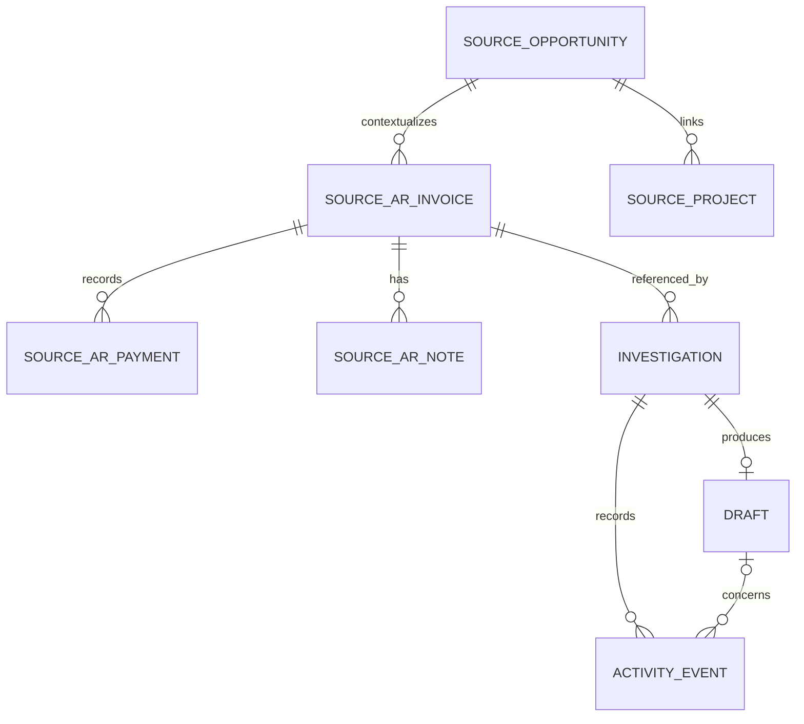

# Data and financial contract

This file owns source relationships, calculated fields, triage, historical reconstruction, and application entities. These are implementation rules for the selected export, not a claim that the extract is a reconciled accounting ledger. [Reference reviews](reference/Data_Reconcilable.md) cover broader possibilities; [unresolved evidence](reference/Data_Unresolved.md) remains unresolved.

## Source and assumptions

Input: [source_data.sql](reference/source_data.sql), schema `source_company`, 42 tables / 1,075 rows. `dataset_metadata.dataset_as_of` is **2026-07-28** and the dataset declares itself synthetic. Original file SHA-256:

```text
776ddd451c21f5fa85696b2ad5b170e1a1358bb08db54d813a441ce9a9247906
```

Preserve the dump. Source IDs are strings, not universally valid UUIDs. The three platform categories below are logical business origins in a consolidated export, not verified platform-specific integrations.

**Reporting conventions:** use UTC calendar dates from supplied timestamps and end-of-day inclusion through the source cutoff. This is a demo convention, not a documented company accounting timezone. AR rows have no currency column: display dollar amounts under an explicit **USD assumed for this demo** label in calculation scope; do not imply source-verified currency or support conversion. Source dates determine business reporting; current UTC timestamps record application activity. Do not advance the reporting cutoff to today's date.

## Relevant source entities and joins

| Context | Tables / explicit relationship | Use |
|---|---|---|
| Invoice anchor | `ar_invoices.id`; 21 rows | Status, totals, invoice/due/posting/sent dates, customer/contact/opportunity IDs. |
| Receipt evidence | `ar_payments.invoice_id → ar_invoices.id`; 10 rows | Applied receipts and their payment dates. |
| Collection narrative | `ar_invoice_notes.invoice_id → ar_invoices.id`; 2 rows | Dated statements, not authoritative balance changes. Also retain any invoice-level `notes`. |
| CRM/customer | `ar_invoices.company_id → companies.id`; `contact_id → contacts.id`; `companies.billing_contact_id → contacts.id` | Invoice customer, recorded contact, company notes. Do not confuse customer with the contractor's `legal_entity_id`. |
| Job context | `ar_invoices.opportunity_id → opportunities.id`; `projects.opportunity_id → opportunities.id` | Job number/name, operational status, completion, and reporting/operating branch. |
| Ownership | `engagement_assignments.opportunity_id → opportunities.id`; `employee_id → employees.id` | Known Primary AE / Primary Ops Manager assignments; preserve capacity labels. |
| Project narrative | `project_notes.project_id → projects.id` | Additional operational statements, with source dates/authors. |
| Supporting metadata | `branches`, `legal_entities`, `documents`, `dataset_metadata` | Names, provenance, reporting cutoff, and document availability—not unseen document text. |

There is one project for each won opportunity in this extract. Project IDs happen to equal opportunity IDs, but join on `projects.opportunity_id`, not that coincidence. Project site names are null: display the linked opportunity's site name with its provenance. Source project/opportunity statuses describe different stages.

Use left joins for optional context. Missing context must not remove an invoice from the worklist. Aggregate payments **per invoice before joining** assignments, notes, or other one-to-many records; otherwise receipt amounts multiply. Return multiple assignments as a list, not duplicate financial rows. If unexpected multiple linked projects exist, retain a warning rather than choosing an arbitrary row.

Suggested customer contact: invoice contact first, then company billing contact with an explicit fallback label. Preserve mismatches between a contact's company and the billed company for review. Missing operations ownership is a warning, not proof that the customer should not be contacted. Internal finance/billing recipients are not supplied as a team mailbox; do not invent one.

## F1 — Recorded invoice position

Use PostgreSQL `NUMERIC` and Python `Decimal`; serialize money to two-decimal strings. The browser never recalculates business totals. For invoice `i` at cutoff `t`:

```text
paid_to_date(i,t) = sum(ar_payments.amount where invoice_id=i and payment_date_utc <= t)
remaining_balance(i,t) = invoice.total - paid_to_date(i,t)
```

An absence of matching payment rows means zero **recorded** receipts, not proof that no payment occurred externally. Do not add `gl_entries.AR_COLLECTION` to these receipts, or add GL billing to invoice totals. Do not infer receipt dates from invoice or due dates. Do not deduplicate distinct payment IDs merely because amounts match.

Derived payment position is separate from source invoice status: no receipts / partially paid / paid in export / credit or inconsistent position / unknown. Keep a negative remainder visible as an exception; never silently convert it into a zero balance. Missing required amounts or receipt dates make the affected calculation uncertain rather than zero.

## F2 — Reporting populations

The primary AR summary uses invoices whose **current source status is `SENT`** and whose UTC send date is on/before the source cutoff, less their recorded receipts. Current data has 16 such invoices, all with send dates. Draft, approved, and sync-failed invoices are visible elsewhere, not added to that AR figure.

| Check at July 28, 2026 | Expected |
|---|---:|
| SENT invoice face value, 16 invoices | $2,805,000.00 |
| Recorded receipts against that population | $1,696,536.00 |
| Remaining recorded AR, 9 positive balances | **$1,108,464.00** |
| Overdue portion, 5 positive balances | **$719,004.00** |
| Not-yet-due portion, 4 positive balances | $389,460.00 |
| APPROVED, 2 invoices | $142,800.00 |
| DRAFT, 2 invoices | $169,000.00 |
| Unsent billing to review, APPROVED + DRAFT | **$311,800.00** |
| SYNC_FAILED, 1 invoice, outside the AR summary | $57,300.00 |

Unsent totals are invoice face values, not collectible overdue AR. The sync-failed row has a send date: excluding it is a deliberately conservative, **status-scoped** reporting choice, not proof the customer never received it. Summary cards always retain this scope; filtering the list must not silently change their meaning. Unexpected invalid/credit positions require a visible metric limitation, not an unqualified “verified total.”

## F3 — Dates and aging

A positive SENT balance is overdue only when `due_date_utc < as_of_date`. Its overdue days equal the calendar-day difference; due today is zero. Paid records have zero overdue days. Show no collection-aging value for unsent billing; show unknown when the required due date is missing. If age buckets are displayed, use Current, 1–30, 31–60, 61–90, and 91+ **days past due**.

The supplied AP/AR invoice due dates are all 30 calendar days after invoice dates. Preserve explicit dates; do not derive a replacement due date from ingestion or send date. `created_at` is not a trustworthy financial event date here: financial records were loaded together on July 24.

Terms and aging are different. For a hypothetical July 20 invoice, Net 30 means August 19, Net 60 September 18, and Net 90 October 18. A Net 60 invoice actually paid October 2 contributes to September's due obligations and October's receipts. A promise, approval, copied message, or due date never reduces AR. Posting dates define a posting-period view, not cash receipt timing. These calendar examples are test fixtures, not extra source terms.

## F4 — Worklist triage and action eligibility

Evaluate in order. Rule-based warnings may conservatively ask for review; they do not resolve source contradictions.

| Precedence / category | Rule | AI may propose |
|---|---|---|
| 1. `verify` — Verify first | `SYNC_FAILED`; unsupported status or inconsistent required facts; or a zero-balance invoice with an invoice note dated after its latest recorded payment. | Internal verification or no outreach; never a customer payment demand. |
| 2. `billing` — Billing review | `DRAFT` or `APPROVED`, no send date, without a higher-priority integrity exception. | Internal billing review, internal verification, or no outreach. |
| 3. `collect` — Collection follow-up | `SENT`, positive remaining balance, valid send date, due before cutoff, no blocking verification flag. | Customer follow-up, internal verification, or no outreach. |
| 4. `monitor` — Not yet due | `SENT`, positive balance, due on/after cutoff. | No overdue outreach; no draft in this MVP. |
| 5. `settled` — Paid in export | `SENT`, zero balance, no higher-priority exception. | No collection outreach; no draft. |

A missing due date, negative balance, SENT row without a valid send date, or DRAFT/APPROVED row with a send date routes to verification. Missing a customer email changes the available recipient, not the accounting balance; propose internal verification rather than inventing an address.

**Later-note heuristic:** a post-payment note is a conservative review trigger, not deterministic proof that its text contradicts payment. Label it “Later note needs review.” The agent must read the actual note before describing a contradiction. Do not hardcode invoice IDs or run NLP over every invoice to populate the queue. The two source notes yield the intended contrasting cases without a separate classification service.

Expected partition: **5 collect / 4 billing / 2 verify / 4 monitor / 6 settled = 21**. Seven invoices are paid in the export; one of those remains in Verify first because of its later note.

Ordering: Collections by overdue days descending, remaining balance descending, then invoice number. Billing by COMPLETED/CLOSED project first, invoice total descending, then invoice number. Verify first by evidence conflict before sync failure, then invoice number; new integrity exceptions go first. All groups verify, collect, billing, monitor, settled; apply the same within-group rules. Monitor sorts by due date, then invoice number. No numerical “recovery score” or expected-cash ranking.

## F5 — Compact historical trend

Use all 16 invoices in the current SENT population, **including those now fully paid**. For each UTC day May 1–July 28, 2026:

```text
included(i,t) = source status is SENT and sent_date_utc <= t
balance_at_t(i) = invoice.total - sum(payments for i with payment_date_utc <= t)
outstanding(t) = sum(balance_at_t(i) for included invoices)
overdue(t) = sum(positive balance_at_t(i) for included invoices with due_date_utc < t)
```

All selected data has valid send/payment dates and no pre-send payments or credit adjustments. If a replacement dataset violates those assumptions, flag/exclude unsupported historical calculations with a visible reason; do not silently invent event timing or adjustment logic.

Use a step-style graph, not smoothed values between financial events. Tooltip values come from backend strings. Label it **“Reconstructed balances for 16 currently SENT invoices; not complete historical accounting AR.”** Current statuses are known only at the snapshot, so do not imply a historical status audit. No future projections or simulated recovery events.

The same selected population reconciles by month:

| Period | Opening | Invoices added by sent date | Receipts by payment date | Closing |
|---|---:|---:|---:|---:|
| May 2026 | $0.00 | $931,400.00 | $146,200.00 | $785,200.00 |
| June 2026 | $785,200.00 | $1,209,400.00 | $915,100.00 | $1,079,500.00 |
| July 1–28, 2026 | $1,079,500.00 | $664,200.00 | $635,236.00 | $1,108,464.00 |

A zero opening means no selected invoices were yet sent, not that the company's opening AR was zero. Increasing AR can reflect newly issued invoices, not failed collection. Do not name these movements revenue growth, bank cash, or AI-assisted recovery.

## F6 — Regression fixtures

Locate fixtures by invoice number in tests; application joins use IDs. Exact generated wording is not a test requirement.

| Invoice | Required facts at cutoff | Expected behavior |
|---|---|---|
| INV-2026-0515 | $178,100 remaining; 26 days overdue; project IN_PROGRESS; no primary Ops Manager assignment | First collection item; missing owner is visible, not an invented billing blocker. |
| INV-2026-0502 | $216,500 total − $129,900 payment = $86,600; 19 days overdue | Acknowledge partial payment. Note's “next check run” is not an exact promise date. |
| INV-2026-0526 | $173,500 remaining; 18 days overdue | Operational note may inform an internal question; it does not prove a customer dispute. |
| INV-2026-0538 | $246,300 remaining; 14 days overdue | Large balance does not outrank older invoices under the chosen default ordering. |
| INV-2026-0549 | $90,800 − $56,296 = $34,504; due July 26 | Two days overdue, not invoice-age overdue. |
| INV-2026-0596 | $116,700 DRAFT; project completed July 9; no sent date | Billing review, not customer collection. Cause of unsent billing is unknown. |
| INV-2026-0455 | $122,600 fully paid June 16; July 24 note refers to overdue balance | Verify first; preserve both records; no payment demand or local resolution. |
| INV-2026-0553 | $57,300 SYNC_FAILED with June 30 send date | Verify first; outside headline AR; do not assume unsent. |
| INV-2026-0571 | $67,560 remaining; due August 5 | Not yet due; no overdue reminder. |
| INV-2026-0491 | $304,200 fully paid June 4; still SENT | Paid in export, not outstanding; still contributes to historical reconstruction. |

## Application-owned entities



The invoice-to-investigation link is a logical source reference, not a cross-schema FK. Create only three application tables; use app UUID primary keys, app-local foreign keys, and UTC audit timestamps.

| Table | Fields / constraints |
|---|---|
| `app.investigations` | `id`, `invoice_id` string, `snapshot_as_of` date, `input_hash`, `analysis_version`, `model`, `status` (running/completed/failed), `input_json`, nullable `output_json`, `trace_json`, nullable `usage_json`, `started_at`, nullable `finished_at`, nullable sanitized `error_code` / `error_message`. Index invoice/start time; partial unique invoice/input_hash while running. |
| `app.drafts` | `id`, unique `investigation_id` FK, `audience` (customer/internal), nullable `recipient_ref`, `original_subject`, `original_body`, `subject`, `body`, `created_at`, `updated_at`. Originals never change. No source-update/status fields. |
| `app.activity_events` | `id`, `investigation_id` FK, nullable `draft_id` FK, `kind` (assessment_completed/draft_saved/draft_copied), `created_at`. Append-only application activity; no invented authenticated actor. |

`InvoicePosition` and `ARTrend` are computed responses, not stored balance tables. Position includes invoice/source IDs, display context, source status, total/paid/remainder, derived payment position, overdue days, category, reason, warnings, and evidence references. Trend contains date/amount points, population label, monthly movements, and limitations. Keep input JSON scoped to the selected invoice and its related entities, not the entire dump.

## Evidence and reuse identity

A source evidence reference identifies a table and source ID, e.g. `source_company.ar_payments:<id>`. A calculation reference such as `calc:invoice_position:<invoice_id>` carries its formula name, values, and contributing source refs. The backend constructs these references and their payloads. Model citations can select only references actually exposed during that run; existence in the database alone is not sufficient.

Persist the input evidence and returned tool sections with the investigation. This is the record of what the assessment saw, not a claim that the model's interpretation is verified. Use canonical JSON (stable key/row order, Decimal strings, ISO dates, preserved nulls) to hash the complete permitted invoice bundle plus cutoff, analysis version, and effective model configuration. Exclude application retrieval/run timestamps and mutable draft/activity content from the hash. Source records' own dates/content remain included. This supports safe reuse and stale detection without a background cache service.

## Source locators

All line numbers refer to the original SQL, not this document. Header/data: invoices 350–375 / 1297–1319; payments 382–392 / 1326–1337; invoice notes 336–343 / 1287–1290. Context: companies 1762–1789; contacts 1852–1871; employees 1960–1971; assignments 1978–2036; opportunities 2249–2287; project notes 2323–2327; projects 2334–2360. Metadata 1904–1910. Financial checks above are calculations over those records. Triage, UTC-date reporting, currency display, and action gates are explicit product choices, not inferred source-system rules.
